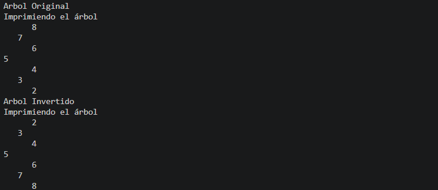
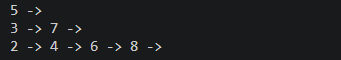
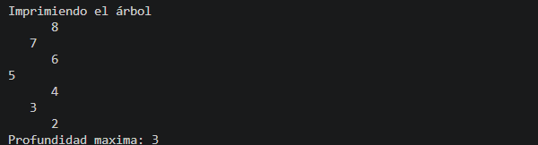

# Ejercicios Arboles

# Nombre: Mateo Lema

# Descripción del proyecto

En esta practica trabajamos con estructuras de datos no lineales como lo son los árboles. Realizamos cuatro ejercicios donde aplicamos
lo aprendido sobre la jerarquia de los arboles. Además se resolvieron mediante el uso de la recursividad.


## Ejercicio 1

## Explicación del ejercicio

En el primer ejercicio tenemos un metodo que recibe un un arreglo de numeros. Luego, creamos una nuevo arbol y recorremos 
la lista para agregar los nodos del arbol. Utilizamos el metodo add que esta en la clase BinarytTree para poder ordenar 
de manera que en el subarbolizquierdo esten los que tengan un valor menor al nodo y en el subarbolderecho esten los que 
tengan un valor mayor al nodo.


## Captura Salida


## Codigo

```java

public class Ejercicio1 {

    public void insert(int[] numeros) {


        BinaryTree<Integer> arbolNumeros = new BinaryTree<>();
        for (int i = 0; i < numeros.length; i++) {
            arbolNumeros.add(numeros[i]);
        }

        printTree(arbolNumeros.getRoot());

    }

    public void printTree(Node<Integer> root) {
        System.out.println("Imprimiendo el árbol");
        printTreeRecursivo(root, 0);
    }

    private void printTreeRecursivo(Node<Integer> actual, int nivel) {

        if (actual == null)
            return;

        printTreeRecursivo(actual.getRightNode(), nivel + 1);

        for (int i = 0; i < nivel; i++) {
            System.out.print("   ");
        }
        System.out.println(actual.getValue());
        printTreeRecursivo(actual.getLeftNode(), nivel + 1);
    }

}

```


## Ejercicio 2

En el ejercicio dos tenemos el metodo invertirRecursivo que recorre el árbol nodo por nodo. Luego intercambia los hijos izquierdo y derecho. 
Guarda temporalmente el hijo que esta a la izquierda, luego pone el hijo derecho en la izquierda y despues vuelve a colocar  el hijo izquierdo
 en la derecha. Este proceso se repite con el resto del arbol .


## Explicación del ejercicio


## Captura Salida


## Codigo
```java
public class Ejercicio2 {

    public void inverTree(Node<Integer> root) {
        System.out.println("Arbol Original");
        printTree(root);

        invertirRecursivo(root);

        System.out.println("Arbol Invertido");
        printTree(root);
    }

    public void printTree(Node<Integer> root) {
        System.out.println("Imprimiendo el árbol");
        printTreeRecursivo(root, 0);
    }

    private void printTreeRecursivo(Node<Integer> actual, int nivel) {

        if (actual == null)
            return;

        printTreeRecursivo(actual.getRightNode(), nivel + 1);

        for (int i = 0; i < nivel; i++) {
            System.out.print("   ");
        }

        System.out.println(actual.getValue());

        printTreeRecursivo(actual.getLeftNode(), nivel + 1);
    }

    private void invertirRecursivo(Node<Integer> actual) {

        if (actual == null)
            return;

        
        Node<Integer> auxiliar = actual.getLeftNode();
        actual.setLeftNode(actual.getRightNode());
        actual.setRightNode(auxiliar);

       
        invertirRecursivo(actual.getLeftNode());
        invertirRecursivo(actual.getRightNode());
    }
}
```

## Ejercicio 3

## Explicación del ejercicio

El método listLevels recorre el arbol por niveles utilizando una cola. Primero coloca la raíz en la cola y toma todos los nodos que pertenecen al nivel actual. Cada nodo se guarda en una lista correspondiente a ese nivel y, si tiene hijos, estos se agregan a la cola para ser procesados después.Cuando termina de recorrer todo el  nivel toma esa lista y se añade al resultado y el proceso se repite con el siguiente nivel.Asi puede obtener la lista que contiene todos los nodos que esten a la misma profundidad en el arbol. Despues utilizamos el método printLevels recorre esas listas e imprime los valores de cada nivel por separado.


## Captura Salida


## Codigo

```java
public class Ejercicio3 {

    public List<List<Node<Integer>>> listLevels(Node<Integer> root) {

        List<List<Node<Integer>>> resultado = new ArrayList<>();
        if (root == null) {
            return resultado;
        }
        Queue<Node<Integer>> cola = new LinkedList<>();
        cola.offer(root);
        while (!cola.isEmpty()) {
            int size = cola.size();
            List<Node<Integer>> nivel = new ArrayList<>();
            for (int i = 0; i < size; i++) {
                Node<Integer> actual = cola.poll();
                nivel.add(actual);
                if (actual.getLeftNode() != null) {
                    cola.offer(actual.getLeftNode());
                }
                if (actual.getRightNode() != null) {
                    cola.offer(actual.getRightNode());
                }
            }
            resultado.add(nivel);
        }
        return resultado;
    }

    public void printTree(Node<Integer> root) {

        System.out.println("Imprimiendo el arbol");
        printTreeRecursivo(root, 0);

    }

    private void printTreeRecursivo(Node<Integer> actual, int nivel) {

        if (actual == null)
            return;

        printTreeRecursivo(actual.getRightNode(), nivel + 1);

        for (int i = 0; i < nivel; i++) {
            System.out.print("    ");
        }
        System.out.println(actual.getValue());
        printTreeRecursivo(actual.getLeftNode(), nivel + 1);

    }

    public void printLevels(Node<Integer> root) {

        List<List<Node<Integer>>> niveles = listLevels(root);
        for (List<Node<Integer>> nivel : niveles) {
            for (Node<Integer> nodo : nivel) {
                System.out.print(nodo.getValue() + " -> ");
            }
            System.out.println();
        }
        
    }

}
```
## Ejercicio 4

## Explicación del ejercicio

En el ejercicio 4 utilizamos el metodo getDepth para calcular la produndidad maxima. Para cada nodo primero obtenmos la altura del subárbol izquierdo
 y la del subárbol derecho. Luego comaparamos ambas alturas y nos quedamos con la mayor ya que queremos la prondidad maxima. Finalmente suma uno para contar el nodo actual y devuelve ese valor. Nuestro caso baso para el metodo recursivo es cuando el nodo sea null. Si es null nos devuelve el 0 y asi detenmos el metodo. 


## Captura Salida


## Codigo

```java
public class Ejercicio4 {

    public int getDepth(Node<Integer> actual) {
    
        if(actual == null)
            return 0;

        int heightLeft = getDepth(actual.getLeftNode());
        int heightRight = getDepth(actual.getRightNode());

        int masAlto = Math.max(heightLeft, heightRight);

        return masAlto + 1;

    }

    public void printTree(Node<Integer> root) {
        System.out.println("Imprimiendo el árbol");
        printTreeRecursivo(root, 0);
    }

    private void printTreeRecursivo(Node<Integer> actual, int nivel) {

        if (actual == null)
            return;

        printTreeRecursivo(actual.getRightNode(), nivel + 1);

        for (int i = 0; i < nivel; i++) {
            System.out.print("   ");
        }

        System.out.println(actual.getValue());

        printTreeRecursivo(actual.getLeftNode(), nivel + 1);
    }

    
}
```

## Conclusiones 

En la resolución de estos ejercicios se utilizaron metodos recursivos y esto permitio entender mejor el uso de la recursividad.
En todos los ejercicios utilizamod la recursividad para poder imprimir el arbol

También podemos utilizar los conceptos teoricos para poder resolver los ejercicios y asi poder entender como funciona las 
estructuras de los arboles.


